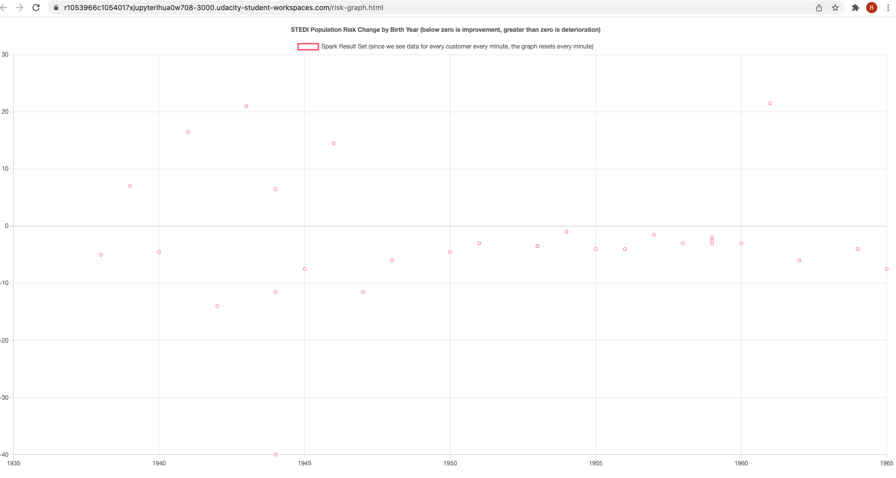
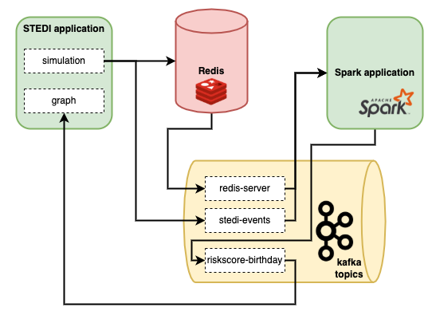

# Public Transit Status with Apache Kafka

This project is part of the [Udacity Nanodegree Data Streaming](https://www.udacity.com/course/data-streaming-nanodegree--nd029).

## Project description

STEDI is a small startup focused on assessing balance for seniors. STEDI has created a model that predicts the fall risk based on a [simple exercise](https://youtu.be/XosjuXTCGeg). During the exercise, the senior takes 30 steps which are recorded by an examinator. When the exercise has been recored 4 times, a *risk-score* will be calculated. 

The aim of the project is to provide data to create a live graph which displays the relation between the risk-score and the year or birth of the seniors, as soon as the data is generated. Data pipelines are in place to store customer identification data, the results of the exercises and the calculated risk-scores. In order to create the display, the customer identification data needs to be combined with the calculated risk-scores.

The final graph with look like so and will be continuously updated:



## Tools and technologies. 

The project uses Spark, Kafka and Redis. The architecture looks like so:



## Data

There are three data sources:

- Customer identification data
- Exercise data
- Risk scores

### Redis

Customer identification data and Exercise data is stored in Redis. This data is made available in kafka using the kafka-connect connector for Redis. In this project, we will take the Customer data from the kafka topic `redis-server`. The RapidStepTest data is used to simulate risk-scores. This is done automatically when the simulation is run (see below). 

The data in Redis has the following format:

| Sorted Set    | Description                     | Fields                                                                                                  |
| ------------- | ------------------------------- | ------------------------------------------------------------------------------------------------------- |
| Customer      | Customer data                   | customerName (str), email (str), phone (str), birthDay (str)                                            |
| RapidStepTest | Data collected during step test | token (str), startTime (int), stepPoints (List[int]), stopTime (int), totalSteps (int), customer (dict) |

### Kafka topics

We will make use of the kafka topics `redis-server` and `stedi-events`.

The topic `redis-server` contains the customer identification data as well as the exercise data (RapidStepTest). The data has the following JSON format:

```json
{"key":"Q3VzdG9tZXI=",
"existType":"NONE",
"Ch":false,
"Incr":false,
"zSetEntries":[{
"element":"__eyJjdXN0b21lck5hbWUiOiJTYW0gVGVzdCIsImVtYWlsIjoic2FtLnRlc3RAdGVzdC5jb20iLCJwaG9uZSI6IjgwMTU1NTEyMTIiLCJiaXJ0aERheSI6IjIwMDEtMDEtMDMifQ==__",
"Score":0.0
}],
"zsetEntries":[{
"element":"eyJjdXN0b21lck5hbWUiOiJTYW0gVGVzdCIsImVtYWlsIjoic2FtLnRlc3RAdGVzdC5jb20iLCJwaG9uZSI6IjgwMTU1NTEyMTIiLCJiaXJ0aERheSI6IjIwMDEtMDEtMDMifQ==",
"score":0.0
}]
}
```

Note that the data is base64 encoded. The decoded key is either `Customer` or `RapidStepTest` whereas the `zSetEntries[0].element` contains the data corresponding to the respective Redis Sorted Set. The content of the `zSetEntries[0].element` field is stored in JSON format with the entries as specified in the Redis section above. In this project we need to filter the `Customer` data from the `redis-server` topic. 

The topic `stedi-events` contains the calculated risk-scores. The data has the following JSON format:

```json
{
    "customer":"Jason.Mitra@test.com",
    "score":7.0,
    "riskDate":"2020-09-14T07:54:06.417Z"
}
```

The aim of this project is to create a new kafka topic in which data from the `redis-server` and `stedi-events` topics are joined. 

## Installation instructions

The project utilizes Spark, Kafka and Redis. The installation is done in a containerized fashion using Docker. Detailed installation instructions for installing the necessary software to run the project on your own device can be found [here](installation_instructions.md). 

## Running instructions

1. Start Kafka: `/home/workspace/startup/startup.sh`
2. Start Spark:
   
   - Start spark master: `/data/spark/sbin/start-master.sh`
   - Read spark master URI from logs: `cat <logfile>`
   - Start spark worker: `/data/spark/sbin/start-slave.sh <spark:URI>`

3. Run the STEDI exercise simulation:

   - Start the STEDI application: Click the blue button on the third page of [`Guide.ipynb`](Guide.ipynb)
   - Log in to the STEDI application:  Click the next blue button on the third page of [`Guide.ipynb`](Guide.ipynb)
   - Start the simulation in the STEDI application (make sure kafka is up and running otherwise your data will not be send from redis to kafka): From the timer page, use the toggle button in the upper right corner to activate simulated user data to see real-time customer and risk score data. Toggle off and on to create additional customers for redis events. Each time you activate it, STEDI creates 30 new customers, and then starts generating risk scores for each one. It takes 4 minutes for each customer to have risk scores generated, however customer data is generated immediately. The kafka topic `stedi-events` is created once the first risk score is calculated. To monitor the progress of data generated you can check the logs: `tail -f /home/workspace/stedi-application/stedi.log`

4. Send the job [`sparkpykafkajoin.py`](sparkpykafkajoin.py) to the Spark cluster to combine the customer data with the risk-score data and create a new topic in Kafka with the combined data. A bash script is provided to run the spark job:

    ```bash
    submit-event-kafkajoin.sh
    ```

5. The graph should now be populated with the simulated customer and risk-score data. To open the graph go to the STEDI application and click on *graph*. You should see the graph being updated live as the data flows through kafka.

The original project instructions as provided by Udacity can be found in the [`Guide`](Guide.ipynb).