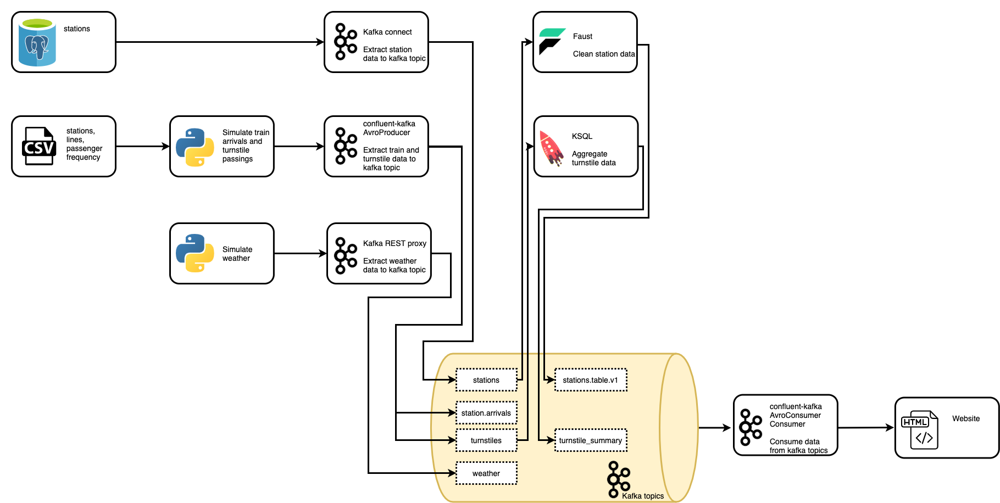

# Public Transit Status with Apache Kafka

This project is part of the [Udacity Nanodegree Data Streaming](https://www.udacity.com/course/data-streaming-nanodegree--nd029).

## Project description

The [Chicago Transit Authority (CTA)](https://www.transitchicago.com/) operates the USA's second largest public transportation system and covers the City of Chicago and 35 surrounding suburbs. On an average weekday, approximately 1.6 million rides are taken on the CTA. In order to supply commuters with real time information, CTA want to develop a dashboard displaying system status for its commuters. This website will monitor trains as they move from station to station and to keep track of the number of passengers at each station:

## Data

The aim is to show both train and passenger data per station. In addition weather data will we displayed.

In this project we will NOT connect to a live API to retrieve data. Instead we will work with simulated data which is
derived from real CTA data. 

The different data sources available to the project are:
- Postgres: `stations` table with an overview of all available stations, including information which lines stop at the station.
- [`producers/data/*.csv`](producers/data/): Information on lines, stations and commuter frequencies at stations. This data is used to simulate trains arriving at / departing from stations, as well as the number of passengers that enter the station at any given time.
- Weather data: Entirely based on simulation in [`producers/models/weather.py`](producers/models/weather.py)
- [`simulation.py`](producers/simulation.py) for running the simulation

## Tools and technologies

The project uses Kafka and ecosystem tools to accomplish this task. The different tools are:

- confluent-kafka
- REST Proxy
- Kafka Connect
- Faust
- KSQL

Our architecture will look like so:

## Installation and running instructions

The project utilized many different Kafka compontents. The installation of these components in done in a containerized fashion using Docker. Detailed installation instructions for installing the necessary software to run the project on your own device can be found [here](installation_instructions.md). Instructions on how to run the project can be found [here](project_instructions.md#running-the-simulation).

For reference, the orignal Udacity project instructions are included [here](project_instructions.md). 

## Overview of topics

| topic                                          | source                                   | method                         | serialization | file                          | ETL step | description                        |
| ---------------------------------------------- | ---------------------------------------- | ------------------------------ | ------------- | ----------------------------- | -------- | ---------------------------------- |
| org.chicago.cta.station.arrival.<station_name> | simulated data (producers/simulation.py) | confluent-kafka (AvroProducer) | avro          | producers/models/station.py   | L        | load train arrival data into kafka |
| org.chicago.cta.station.turnstile              | simulated data (producers/simulation.py) | confluent-kafka (AvroProducer) | avro          | producers/models/turnstile.py | L        | load turnstile data into kafka     |
| org.chicago.cta.weather.v1                     | simulated data (producers/simulation.py) | kafka REST proxy               | avro          | producers/models/weather.py   | L        | load weather data into kafka       |
| org.cta.chicago.stations                       | postgres table                           | kafka-connect                  | avro          | producers/connector.py        | EL       | load station data into kafka       |
| TURNSTILE_SUMMARY                              | org.chicago.cta.station.turnstile        | KSQL                           | json          | consumers/ksql.py             | T        | transform turnstile info           |
| org.chicago.cta.stations.table.v1              | org.cta.chicago.stations                 | faust                          | json          | consumers/faust_stream.py     | T        | transform station info             |

